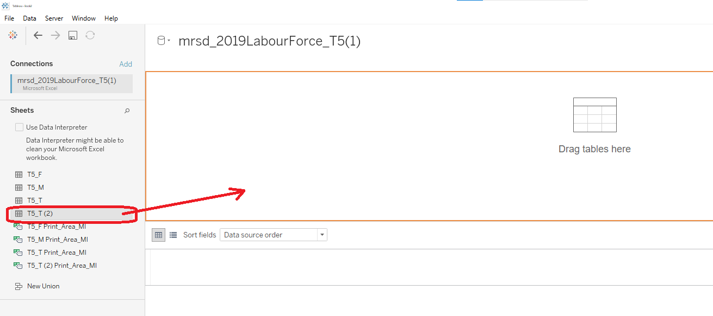

```{r setup, include=FALSE}
knitr::opts_chunk$set(echo = FALSE)
```

Presently, this is the graph presented by the Ministry of Manpower on the Labour Force Participation Rate in 2009 and 2019

```{r, echo=FALSE, fig.cap="Resident Labour Force by Age", fig.align='center',layout="l-body-outset",dpi=200}

```

---

## **Graph Critiques**


|Clarity|Critique|
|-|--------|
|1. |The missing Y-axis does not identify what are the measured values in the graph. We are therefore unable to interpret what the line graphs stand for|
|2. |The missing X-axis Labels does not indicate what are the category representation. We see a range of numbers but have no clear indication that it is an age category|
|3. |The table data does not tell to us what the data represents, and how it is related to the graph|
|4. |The title of the graph does not lead the readers to understand what is to be represented in the graph|
|5. |The vertical reference line does not match up to the age category data points, as the age category is a range but the median age is an absolute number|
|6. |The data indicates the month of June. Does it mean that this is the particular data in the month of June, or this is a data for the year?|


|Aesthetics|Critique|
|-|--------|
|1. |The white fonts in the table are not easily read, and the table could have been on a clear background for easier visuals|
|2. |The font for "Median Age in June 2009" and "Median Age in June 2019" is not consistent. One is bold and one is not|
|3. |The grey background of the chart is not appealing on a white page, and should be on a white background for a cleaner look|

---

## **What Can Be Improved?**

```{r, echo=FALSE, fig.cap="Sketch of Proposed Design", fig.align='center',dpi=200}
knitr::include_graphics("images/sketch.png")
```


|No. |Improvements|
|-|--------|
|1. |A line graph is drawn for 2009 and 2019 Labour Force Participation Rate (%), to be able to see the trend between the years easily.It helps us have a visual representation that 2019 has a higher labour participation rate than 2009, indicating a larger workforce, but also an older workforce|
|2. |A bar graph of the change in LPFR Rate (Percentage Point), between 2019 and 2009 is drawn with a dual axis. The bar graph represents the rate of change of the labour force participation rate from 2009 to 2019. The higher the bar graph, the larger the change|
|3. |The charts are colour coded for easier visualisation of the positive and negative changes in the labour force participation rates. This allows us to easier visualise where the negative growth are|

---

## **Proposed Tableau Visualisation**

```{r, echo=FALSE, fig.cap="Proposed Tableau Design", fig.align='center',layout="l-body-outset",dpi=300, fig.width=12, fig.height=6}
knitr::include_graphics("images/tableau.png")
```


This is the proposed design for an improved visualisation of the Labour Force Participation Rate. It allows us to see the overall participation rate per Age category, and also the Percentage Point change per Age category. This gives us a holistic view of the situation.

On the left axis, it is represented by the **Labour Force Participation Rate (%)**, denoted by the line graph. As you can see, the line diverges at Age Category 25-29, indicating that a higher percentage of the population has remained in active employment.

On the right axis, it is represented by the **Change in LPFR (Percentage Point)**, denoted by the bar graphs. The bar graph shows us that at Age 20-24, there is a negative growth of youths in the labour force. This could mean that many more youths are choosing to further their education rather than enter the workforce early.

The biggest growth in the labour force is seen at Age category 60 and above. It indicates that the population is retiring later, and many chooses to continue being in active employment well into their retirement years. It could also indicate that many feel they are unable to afford retirement due to the rising cost of living.

---

## **Step by Step Guide to Prepare the Tableau Visualisation**

```{r, echo=FALSE, fig.cap="Original Dataset", fig.align='center',layout="l-body-outset"}
knitr::include_graphics("images/Originaldata.png")
```

The original dataset is presented in this table format, with many blank cells and data we are not interested in. Therefore it is important to clean the dataset before we port it to tableau.

1. Delete off the empty cells

2. Exclude data from Rows 19 onwards, and Row 6

```{r, echo=FALSE, fig.cap="Cleaned Dataset", fig.align='center',layout="l-body-outset"}
knitr::include_graphics("images/cleaneddata.png")
```


The cleaned data selected are the age categories, and dataset between 2009 and 2019.
We are interested in these datasets as it gives us a trend in the growth of labour force participation per age category.


```{r, echo=FALSE, fig.cap="Importing Dataset", fig.align='center',layout="l-body-outset"}
knitr::include_graphics("images/Step1.png")
```


Import the dataset into Tableau using **Connect**, **To a File**, **Microsoft Excel**
Choose the data file of interest and click **Open**

```{r, echo=FALSE, fig.cap="Selecting Dataset", fig.align='center',layout="l-body-outset"}

```

Drag the cleaned data set into the orange box


```{r, echo=FALSE, fig.cap="Rename Columns", fig.align='center',layout="l-body-outset"}
knitr::include_graphics("images/Step3.png")
```

Rename Column F1 to **Age Category**


```{r, echo=FALSE, fig.cap="Pivot Dataset", fig.align='center',layout="l-body-outset"}
knitr::include_graphics("images/Step5.png")
```

Next, highlight columns with years **2009** to **2019** and right click, *Pivot*.
This will help create a Long Table, which will make it easier to plot a line graph.

```{r, echo=FALSE, fig.cap="Rename and Reassign Categories", fig.align='left' }
knitr::include_graphics("images/Step6.png")
```

Rename and Reassign the Date Column to **Year**


```{r, echo=FALSE, fig.cap="Add back Cleaned Dataset", fig.align='center',layout="l-body-outset"}
knitr::include_graphics("images/Step8.png")
```
Add the Cleaned Dataset Table back into Tableau through *Drag and Drop*.


```{r, echo=FALSE, fig.cap="Create Calculated Field- Changes in LFPR (Percentage Point)", fig.align='center',layout="l-body-outset"}
knitr::include_graphics("images/Step9.png")
```

Now, we are trying to create a new calculated field, **Change in LFPR (Percentage Point)**, by clicking *Analysis*, followed by *Create Calculated Field*.

```{r, echo=FALSE, fig.cap="Formula of Calculated Field", fig.align='center',layout="l-body-outset"}
knitr::include_graphics("images/Step10.png")
```

Use formula [2019]-[2009] to obtain the change in the LFPR from 2009 to 2019.
Finally, we are ready to plot the graphs.


<iframe width="560" height="315" src="https://www.youtube.com/embed/MuHbofOWVVg" frameborder="0" allow="accelerometer; autoplay; clipboard-write; encrypted-media; gyroscope; picture-in-picture" allowfullscreen></iframe>

1. *Drag and Drop* **Age Category** to Columns

2. *Drag and Drop* **LFPR (%)** to Rows using a Summation

3. *Drag and Drop* **Changes to LFPR (Percentage Point)** to the right Axis. It will be added towards the Row Column as a Dual Axis.

4. Change the *Marks* of **SUM(LFPR(%))** to *Line* graph

5. Change the *Marks* of **SUM(Changes in LFPR(Percentage Point)** to *Bar* graph.

6. In the *Marks* Tab of **SUM(LFPR(%))**, Drag **Year** to *Color*. This will create different lines representing different years.

7. Drag **Year** to the *Label* square to label the lines on the graph, for easier reference.

8. As we are only interested in **2009** and **2019**, drag **Year** to the *Filter* tab, and filter out Year 2009 and 2019.

9. Next, right click the left axis, and *Move marks to front*. This is so the Line graph will be above the Bar graphs.

10. In the *Marks* Tab of **SUM(Changes in LFPR(Percentage Point))**, Drag **Changes in LFPR (Percentage Point)** to *Color*. This will create different bar chart colour visuals to see negative and positive growth.

11. Update *Colors* of choice by toggling the top right colour pallets to colours of choice.


**Final Product**

```{r, echo=FALSE, fig.cap="Final Product - Tableau Visual", fig.align='center',layout="l-body-outset"}
knitr::include_graphics("images/Step11.png")
```


---

## **Major Observations**


***Inferences from the data***

Labour Force Participation Rate in Age Category **20 -24** fell *2.5%* from 2009 to 2019. As we understand that Singapore's birth rate is falling, and we are an aging population, this fall in LFPR could indicate a smaller workforce of that age group. However, we also understand that the government has provided various avenues to allow students to pursue tertiary education through increased vacancies in Polytechnics, and Universities. Therefore, the reduction in labour force at Age **20-24** may indicate that many have chosen to continue tertiary education.

Labour Force Participation Rate in Age Category **30 -34** to **50-54**, increased between *3.80%* to *5.80%*. This steady increase over the decade could be due to more foreigners choosing to work in Singapore and unfortunately, Singaporeans alone, is unable to fill all required roles in the workforce. As our economy grows, so do manpower needs.

The biggest growth in the Labour Force Participation Rate is in Age Category **60 and above**. The growth is roughly *3 to 4* times higher than other age categories, indicating that more people are choosing to stay actively employed, rather than retire. There may be a few social impacts to this choice, where maybe people are insecure in retiring due to the rising cost of living in Singapore. Many may feel that they are not financially secure to stop working. Or, our population could also be healthier and stronger despite being older, and many could choose to continue working because they feel that they want to continue contributing to the economy.

***Observations from the visuals***

*Graph choices:* It is easier for the human eye to visualise percentage point changes through bar graphs that specifically highlight it. Line graphs do not aid the growing gaps as well.

*Colour:* It is also easier for the human eye to recognise a negative growth value if the colour is red. It helps highlight the outliers quicker and faster. Different colour line graphs also help divide the datasets easier and quicker.

*Labels:* Labels help to guide the human eye to line representations quicker without having to check back to the legend.

*Annotations:* Graph annotations help paint the story quickly, without the reader needing to read the write up. It sends the message of the visuals in a point form, through a quick glance.

***Marrying the Two***

Data may tell us only one point of view, therefore it is important to manipulate it to provide greater insights. Through calculating **Changes in LFPR (Percentage Point)**, we are able to identify that there is *4 times* more growth of the labour force for **Age Category 60 and above**.

Next, using these manipulated data, we can therefore provide better visualisations for readers. It reduces the need for people to understand and inteprete the graphs on their own, but gives them the needed inferences immediately.

Understanding the storytelling is more important than having great visuals and great data. It can easily change the perception and impressions of people if done right.