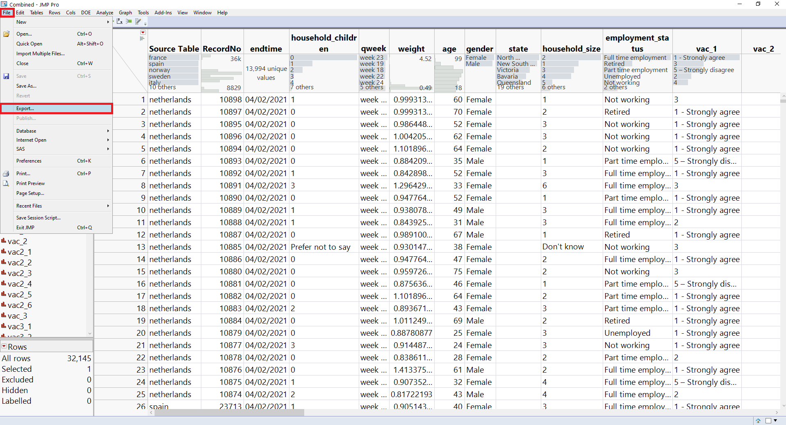
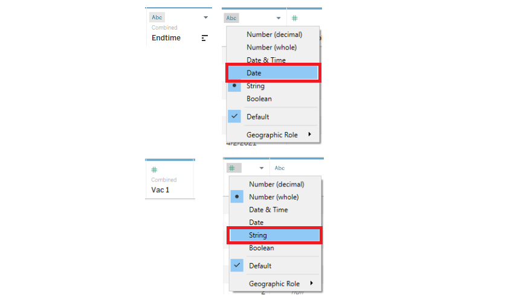
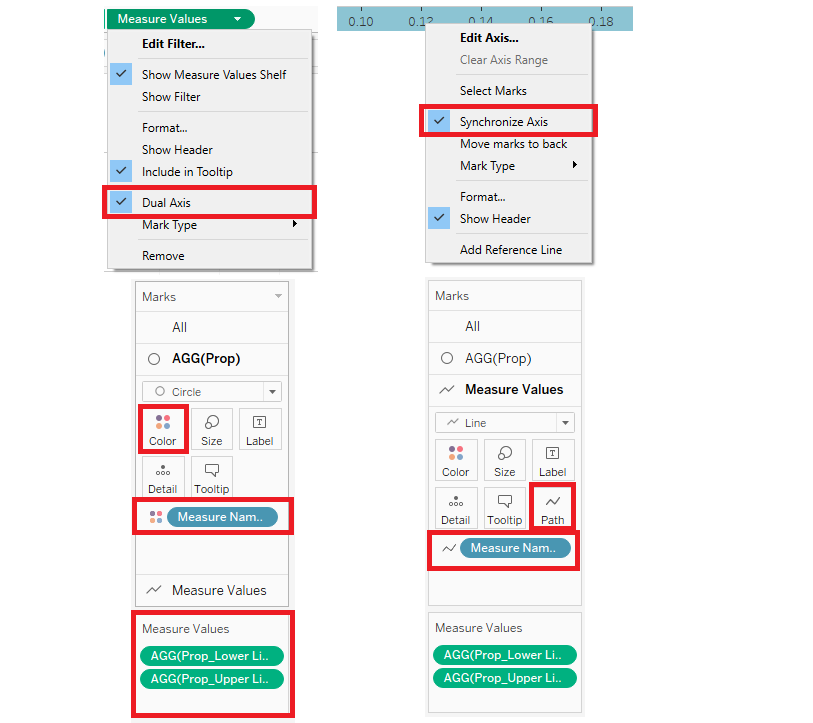

```{r setup, include=FALSE}
knitr::opts_chunk$set(echo = FALSE)
```

Presently, this is the graph presented by a Research Scientist to understand the willingness of the public on Covid-19 vaccination.

```{r, echo=FALSE, fig.cap="Which country is more pro vaccine?", fig.align='center',layout="l-body-outset",dpi=200}

```

---

# **Graph Critiques**


|Clarity|Critique|
|-|--------|
|1. |The legend of Vac 1 does not advise what "Vac 1" stands for, and also does not advise what "2", "3", "4" stands for. This will mislead viewers from understanding what the bar graphs stand for and how to inteprete the data|
|2. |The title of the graph on the left does not relate to the questions of the count. What is the population Strongly Agreeing/Strongly Disagreeing to? Are they agreeing to be Pro Vaccine? Or is the population strongly agreeing to take the Covid19 Vaccine once available to them? The title could be clearer in identifying the focus.|
|3. | The right graph is a repeat of the left graph, but sorted by Strongly Agree Percentages. It does not provide new information from the left, except for an easy visualisation of the sorted countries.It should show the confidence interval of strongly agreed, or the different demographics of the population.|
|4. | The x-axis of the graph on the right ends before the barchart ends. We are unable to identify what percentage of United Kingdom is. The x-axis should end where the data ends for clear representation of the datapoints.|


|Aesthetics|Critique|
|-|--------|
|1. |The colour of the graph on the left is hard to distinguish clearly, on which is "disagreed" vs "agreed". It does not give a good visual cue on the separations between the agreed and disagreed crowd. Therefore it does not help viewers easily identify the polarities in each country |
|2. | The left graph axis has no decimal point, while the right graph has a decimal point on the x axis. It is not consistent. We should keep both axis consistent as they are representing the same data|
|3. |The name of the countries are all small caps. It should start with Capital Letters for appropriate naming|
|4. | There is a spelling error in the Title chart of the graph on the left. It should be checked and improved to prevent spelling errors for a more professional look.|


---

# **What Can Be Improved?**

```{r, echo=FALSE, fig.cap="Sketch of Proposed Design", fig.align='center',dpi=200}
knitr::include_graphics("images/sketch.png")
```


|No. |Improvements|
|-|--------|
|1. | A scatterplot graph is drawn on the top left to give broad overview on where all countries stand in terms of covid confidence. It plots a score on the Y-axis on scores of the questions chosen, and a score on the x-axis, the willingness of the respondents in taking the vaccine.|
|2. | A dropdown question bar on the top is created so that we can view different public sentiments with regards to their willingness to take the vaccine, and their confidence and worries about it.|
|3. | A filter box on the right allows user to toggle between the different countries, and choose which countries they are interested to view. They can view individual countries, or continents, or regions by choosing the Countries of interest.|
|4. | Various confidence intervals are drawn to depict the sentiments based on different categories, such as Employment Status, Household size, Number of Household Children, Age Group and Gender. We are then able to focus on which group of people requires more convincing in taking the vaccine, and which are ready to take it upon distribution.|


---

# **Proposed Tableau Visualisation**

```{r, echo=FALSE, fig.cap="Proposed Tableau Design", fig.align='center',layout="l-body-outset",dpi=300, fig.width=12, fig.height=6}
knitr::include_graphics("images/tableau2.png")
```

---

# **Step by Step Guide to Prepare the Tableau Visualisation**

## Preparing the Dataset

```{r, echo=FALSE, fig.cap="Original Dataset", fig.align='center',layout="l-body-outset"}
knitr::include_graphics("images/step1.png")
```

Dataset is downloaded from *Imperial College London YouGov Covid 19 Behaviour Tracker Data Hub* hosted at Github. It contains individual files from various countries who have conducted surveys on their population.

```{r, echo=FALSE, fig.cap="Combine Datasets using JMP Pro 15.2", fig.align='center',layout="l-body-outset"}
knitr::include_graphics("images/step1.1.png")
```

As we are drawing a graph to compare the different countries, we have to combine the files into 1 large dataset. We will use JMP Pro 15.2 to do this as it uses a small amount of computer memory to fulfill this task. This task can also be done with Tableau Prep Builder using the *Union* feature. 

```{r, echo=FALSE, fig.cap="Concatenate Sheets", fig.align='center',layout="l-body-outset"}
knitr::include_graphics("images/step1.2.png")
```

Add the various *country csv files*, tick the box **Create Source column**, and click **OK**.

```{r, echo=FALSE, fig.cap="Export Combined Dataset", fig.align='center',layout="l-body-outset"}

```

Delete off variables that are not of interest. Keep variables that represent the demographics of the responders, and also **Vac_XX** variables.
Export the JMP Pro file back to excel format by clicking, **File, Export.**

```{r, echo=FALSE, fig.cap="Export to Microsoft Excel", fig.align='center',layout="l-body-outset"}
knitr::include_graphics("images/step1.4.png")
```

Choose **Microsoft Excel** and click **Next**. Save file.

```{r, echo=FALSE, fig.cap="Add Combined Dataset to Tableau & exclude uninterested variables", fig.align='center',layout="l-body-outset"}
knitr::include_graphics("images/step2.png")
```

Open the *Combined Excel Dataset* with *Tableau 2020.4*. The variables chosen are as above.

```{r, echo=FALSE, fig.cap="Update Variables to correct format", fig.align='center',layout="l-body-outset"}

```

Update the variables to the correct format.

- For **End Time**, update to **Date** format.
- For **Vac 1**, update to **String** format.
- For **Source Table**, update to **Geographic Role, Country/Region** and rename to **Country**. 

## Creating Parameters for Questions Dropdown

```{r, echo=FALSE, fig.cap="Create Parameter", fig.align='center',layout="l-body-outset"}

```

*Right Click* Parameters and choose **Create Parameter**

```{r, echo=FALSE, fig.cap="Parameter Questions", fig.align='center',layout="l-body-outset"}

```

Edit the Parameter as the above to create various questions that the user can choose in an interactive way.

```{r, echo=FALSE, fig.cap="Create Calculated Field for Parameter Questions", fig.align='center',layout="l-body-outset"}
knitr::include_graphics("images/step10.png")
```

Next, we want to link a calculated field to the parameter questions. Click on **Analysis**, followed by **Create Calculated Field**

```{r, echo=FALSE, fig.cap="Parameter Codes for the Questions", fig.align='center',layout="l-body-outset"}
knitr::include_graphics("images/step11.png")
```

Create **Questions** Calculated Field and key in the formula as above. This help links the parameter to the variables.

## Update Aliases

```{r, echo=FALSE, fig.cap="Create Aliases", fig.align='center',layout="l-body-outset"}

```

Right click the variables to update the aliases so that when it is plotted the dataset is clearer.
Update **Vac 1**, **Questions** and **Country** columns to the aliases as above.

## Creating Calculated Fields for Scatterplot

```{r, echo=FALSE, fig.cap="Create Calculated Field of Vac 1 Score", fig.align='center',layout="l-body-outset"}
knitr::include_graphics("images/step4.png")
```

Next, we will create **Vac 1 Score** using the **Create Calculated Field**. This score will help update the *String* format of **Vac 1** into a *Number* format so that we can plot a scatterplot.

To do this, click **Analysis** followed by **Create Calculated Field** and type in the formula as above.

Do the same steps as above for **Questions** to create **Question Score**

## Creating Calculated Fields for 95% Confidence Interval

```{r, echo=FALSE, fig.cap="95 Confidence Constant", fig.align='center',layout="l-body-outset"}
knitr::include_graphics("images/z95.png")
```

- Create **Z_95%** Calculated Field

- Create **Number of Records** Calculated Field

```{r, echo=FALSE, fig.cap="Only Strongly Agree", fig.align='center',layout="l-body-outset"}

```

- Create **Only Strongly Agree** Calculated Field

- Create **Proportion** Calculated Field

```{r, echo=FALSE, fig.cap="Prop SE", fig.align='center',layout="l-body-outset"}
knitr::include_graphics("images/propse.png")
```

- Create **Prop_SE** Calculated Field

- Create **Prop_Margin of Error 95%** Calculated Field

```{r, echo=FALSE, fig.cap="Proportion Lower Limit", fig.align='center',layout="l-body-outset"}
knitr::include_graphics("images/proplower.png")
```

- Create **Prop_Lower Limit 95%** Calculated Field

- Create **Prop_Upper Limit 95%** Calculated Field

## Creating Groups

```{r, echo=FALSE, fig.cap="Variable Groups", fig.align='center',layout="l-body-outset"}
knitr::include_graphics("images/group1.png")
```

*Right Click* **Age**, followed by **Create** and **Group**.

- Group the Age groups according to the picture above.

Continue the same steps for **Household Size** and **Household Children**.

## Creating Tooltips

Next we will be creating graphs for the tooltips so that this information will appear when a user hovers over the scatterplot.

```{r, echo=FALSE, fig.cap="Tooltip Graph 1", fig.align='center',layout="l-body-outset"}
knitr::include_graphics("images/tooltip1.png")
```

- Add **Number of Records** to Columns.Update *Measure* to *Sum*.
- Add **Questions** to Rows.
- Add **Number of Records** to *Labels*, and update *Quick Table Calculation*, and *Percent of Total*.
- Add **Questions** to *Colour*.
- Add **Country** to *Filter*, and right click *Show Filter*.

```{r, echo=FALSE, fig.cap="Tooltip Graph 2", fig.align='center',layout="l-body-outset"}
knitr::include_graphics("images/tooltip2.png")
```

- Add **Number of Records** to Columns.Update *Measure* to *Sum*.
- Add **Vac 1** to Rows.
- Add **Number of Records** to *Labels*, and update *Quick Table Calculation*, and *Percent of Total*.
- Add **Vac 1** to *Colour*.
- Add **Country** to *Filter*, and right click *Show Filter*.

## Creating the Overview Tab

```{r, echo=FALSE, fig.cap="Overview of Country's Confidence in Covid19 Vaccine", fig.align='center',layout="l-body-outset"}
knitr::include_graphics("images/overview.png")
```

- Drag **Questions Score** to **Rows**

- Drag **Vac 1 Score** to **Columns**

- Drag **Country** to **Filter**, also to **Colour** and **Labels**

- Right Click **Country** on the **Filter** tab and click **Show Filter**

- Under the drop down bar in **Marks**, choose **Shape**.

- Right Click on **Parameters** and choose **Show Parameters**.


```{r, echo=FALSE, fig.cap="Calculate Average of Vac2 3 Score", fig.align='center',layout="l-body-outset"}
knitr::include_graphics("images/step7.png")
```

Right Click on **Vac1 Score** and choose **Measure, Average**

Right Click on **Question Score** and choose **Measure, Average**

```{r, echo=FALSE, fig.cap="Adding Tooltips to Overview Tab", fig.align='center',layout="l-body-outset"}
knitr::include_graphics("images/tooltip3.png")
```

Click on *Tooltips* to insert the tooltips graphs created earlier.
Sheets can be added by using the *Insert* button, and inserting the Tooltip sheets created as above.

## Creating Employment Status Strongly Agree 95% Confidence Interval

```{r, echo=FALSE, fig.cap="Bar Chart of Questions vs Employment Status", fig.align='center',layout="l-body-outset"}
knitr::include_graphics("images/employmentci.png")
```

- Add **Prop** and **Measure Values** to *Columns*
- Drag **Employment Status** to *Rows*
- Drag **Country** to *Filters*

```{r, echo=FALSE, fig.cap="Questions Format Using Table Calculations", fig.align='center',layout="l-body-outset"}

```
- Right click **Measured Values** and click *Dual Axis*
- Right click the x-axis of the graph, and click *synchronise axis*
- Remove all extra variables in *Measure Values* till only **AGG(Pro_Lower Limit 95%)** and **AGG(Prop_Upper Limit 95% )** is left.
- Under the *AGG(Prop)* in the *Marks* tab, drag **Measure Names** to *Colour*
- Under the *Measure Values* in the *Marks* tab, drag **Measure Names** to *Path*

```{r, echo=FALSE, fig.cap="Add Country Filter", fig.align='center',layout="l-body-outset"}

```

- Right click **Country** and click *Show Filter*

```{r, echo=FALSE, fig.cap="Select Multiple Values (List)", fig.align='center',layout="l-body-outset"}
knitr::include_graphics("images/step16.png")
```

Right click the country filter and change the type to *Multiple Values(list)*

```{r, echo=FALSE, fig.cap="Show Parameter in Legend", fig.align='center',layout="l-body-outset"}
knitr::include_graphics("images/step17.png")
```

Right click **Questions** and click *Show Parameter*

## Creating Gender Strongly Agree 95% Confidence Interval

```{r, echo=FALSE, fig.cap="Confidence Interval of Questions vs Gender", fig.align='center',layout="l-body-outset"}

```

Repeat the same steps as **Employment Confidence Interval** for **Gender Confidence Interval**

## Creating Household Size Strongly Agree 95% Confidence Interval

```{r, echo=FALSE, fig.cap="Confidence Interval of Household Size", fig.align='center',layout="l-body-outset"}

```

Repeat the same steps as **Employment Confidence Interval** for **Household Size Confidence Interval**

## Creating Household children Strongly Agree 95% Confidence Interval

```{r, echo=FALSE, fig.cap="Confidence Interval of Household Children", fig.align='center',layout="l-body-outset"}

```

Repeat the same steps as **Employment Confidence Interval** for **Household Children Confidence Interval**

## Creating Age Strongly Agree 95% Confidence Interval

```{r, echo=FALSE, fig.cap="Confidence Interval of Age Group", fig.align='center',layout="l-body-outset"}

```

Repeat the same steps as **Employment Confidence Interval** for **Age Group Confidence Interval**

## Creating Dashboard

```{r, echo=FALSE, fig.cap="Add all Sheets to Dashboard", fig.align='center',layout="l-body-outset"}

```
- Create a Dashboard by clicking on **Dashboard** on the menu bar, followed by **New Dashboard**
- Drag all the following sheets to the spaces in the Dashboard

```{r, echo=FALSE, fig.cap="Add Questions Bar to Dashboard", fig.align='center',layout="l-body-outset"}
knitr::include_graphics("images/dashboard2.png")
```

Click on the dropdown bar of the scatterplot to add *Parameters, Questions*
Drag the **Questions** bar to the top of the dashboard.
With that, we are done with the Tableau!

---

# Major Observations

***1. Young versus Old ***

```{r, echo=FALSE, fig.cap="Young versus Old", fig.align='center',layout="l-body-outset"}
knitr::include_graphics("images/observation1.png")
```
Older generation of 66 & above, inferred to be the retired population are more pro-vaccine. A higher proportion of them are more agreeable to taking the Covid19 Vaccine, and also have higher trust that their government will provide an effective vaccine. Lastly, they are less worried of the potential side effects of the vaccine.

The younger generation, however, are overall less agreeable to take the Covid19 vaccine.They have less trust in the government providing an effective vaccine, and are more worried of the potential side effect of the vaccine

The most important inference as to why the older generation feels this way, is because for the past 1 year, it is noted that the most vulnerable population to Covid19 are the elderly, and those with pre-existing health conditions.

The biggest casualty of the pandemic tends to be a higher proportionate of elderly population, as their immune system are not as strong and robust as the younger generation. It is also noted that the older population are also more susceptible in catching the virus, as compared to the younger generation. It is seen in the last charts, that the younger generation is not as worried in getting Covid19, as the elderly population.

Therefore we see the trend globally that the elderly population are more open and agreeable to taking the Covid19 vaccine.

***2. Large Household with more than 3 Children versus Small Household with 0-2 Children***

```{r, echo=FALSE, fig.cap="Large Household with more than 3 Children versus Small Household with 0-2 Children", fig.align='center',layout="l-body-outset"}

```

It is noted that larger household with more than 3 children are more worried about the side effects of the Covid19 vaccine, and are less likely to take the vaccine.

Whereas, smaller household with 0 to 2 children are less worried about the side effects of the Covid19 vaccine, and more likely to take the vaccine.

The conclusion we can gather from this data is quite surprising. As we understand that children under the age of 18 are not going to be vaccinated, they will not be protected from Covid19. However, the parents are most afraid of the potential side effects of the vaccine. The conclusion drawn is that parents may be afraid of side effects the vaccine may cause, that may hinder them from continuing to take care of their children.

The solution to this matter would probably to allow the general population to take the vaccine and offer the vaccine to parents after some time, so that they may witness the efficacy, and safety of the vaccine.

***3. Correlations between different countries***

```{r, echo=FALSE, fig.cap="Correlations between different countries", fig.align='center',layout="l-body-outset"}

```

From the scatterplots above, we can infer that a countries effectiveness in convincing the population to get vaccinated is strongly correlated to the trust they have in the government.

If a country trusts the government to provide an effective vaccine, they are more likely to get vaccinated. Therefore it is important that governments continue to communicate and be transparent with their nation. This will help build greater trust and confidence in the vaccines.

However, it is also noted that there is a weak relationship between being worried of getting Covid19, and wanting to take the vaccine immediately. Therefore the fear of catching Covid19 will not fuel the confidence in people to take the vaccine.
