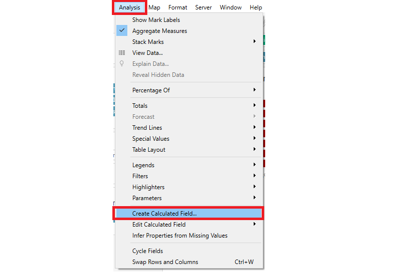

```{r setup, include=FALSE}
knitr::opts_chunk$set(echo = FALSE)
```

Presently, this is the graph presented by a Research Scientist to understand the willingness of the public on Covid-19 vaccination.

```{r, echo=FALSE, fig.cap="Which country is more pro vaccine?", fig.align='center',layout="l-body-outset",dpi=200}
knitr::include_graphics("images/Original.png")
```

---

## **Graph Critiques**


|Clarity|Critique|
|-|--------|
|1. |The legend of Vac 1 does not advise what "Vac 1" stands for, and also does not advise what "2", "3", "4" stands for|
|2. |The colour of the graph on the left is hard to distinguish clearly, on which is "disagreed" vs "agreed". |
|3. |The title of the graph on the left does not relate to the questions of the count. What is the population Strongly Agreeing/Strongly Disagreeing to?|
|4. | The right graph is a repeat of the left graph, but sorted. It does not provide new information from the left, except for an easy visualisation of the sorted countries.|


|Aesthetics|Critique|
|-|--------|
|1. |The colour of the graph on the left is not appealing and clear on the message it is trying to address.|


---

## **What Can Be Improved?**

```{r, echo=FALSE, fig.cap="Sketch of Proposed Design", fig.align='center',dpi=200}
knitr::include_graphics("images/sketch.png")
```


|No. |Improvements|
|-|--------|
|1. | A scatterplot graph is drawn on the top left to give broad overview on where all countries stand in terms of covid confidence. It plots a score on the Y-axis on the willingness of the country to get the Covid19 Vaccine, and a score on the x-axis, the trust they have in their government to provide an effective vaccine.|
|2. | A dropdown question bar on the top is created so that we can view different public sentiments with regards to their willingness to take the vaccine, and their confidence and worries about it.|
|3. | A filter box on the right allows user to toggle between the different countries, and choose which countries they are interested to view.|
|4. | Various barcharts are drawn to depict the sentiments based on different categories, such as Employment Status, Household size, Number of Household Children, Age Group and Gender.|
|5. | The barchart colours are changed to Red and Blue to dipict Disagree and Agree so that we are able to visualise better the polarities of the sentiments.|
|6. | Neutral responses are excluded so that we are able to view the polarities better in a country.|

---

## **Proposed Tableau Visualisation**

```{r, echo=FALSE, fig.cap="Proposed Tableau Design", fig.align='center',layout="l-body-outset",dpi=300, fig.width=12, fig.height=6}

```

---

## **Step by Step Guide to Prepare the Tableau Visualisation**

```{r, echo=FALSE, fig.cap="Original Dataset", fig.align='center',layout="l-body-outset"}

```


```{r, echo=FALSE, fig.cap="Combine Datasets using JMP Pro 15.2", fig.align='center',layout="l-body-outset"}
knitr::include_graphics("images/step1.1.png")
```


```{r, echo=FALSE, fig.cap="Concatenate Sheets", fig.align='center',layout="l-body-outset"}
knitr::include_graphics("images/step1.2.png")
```

```{r, echo=FALSE, fig.cap="Export Combined Dataset", fig.align='center',layout="l-body-outset"}
knitr::include_graphics("images/step1.3.png")
```

```{r, echo=FALSE, fig.cap="Export to Microsoft Excel", fig.align='center',layout="l-body-outset"}
knitr::include_graphics("images/step1.4.png")
```


```{r, echo=FALSE, fig.cap="Add Combined Dataset to Tableau & exclude uninterested variables", fig.align='center',layout="l-body-outset"}

```


```{r, echo=FALSE, fig.cap="Update Variables to correct format", fig.align='center',layout="l-body-outset"}
knitr::include_graphics("images/step3.png")
```

```{r, echo=FALSE, fig.cap="Create Calculated Field of Vac 1 Score", fig.align='center',layout="l-body-outset"}
knitr::include_graphics("images/step4.png")
```

```{r, echo=FALSE, fig.cap="Create Calculated Field of Vac2 3  Score", fig.align='center',layout="l-body-outset"}

```

```{r, echo=FALSE, fig.cap="Overview of Country's Confidence in Covid19 Vaccine", fig.align='center',layout="l-body-outset"}

```

```{r, echo=FALSE, fig.cap="Calculate Average of Vac2 3 Score", fig.align='center',layout="l-body-outset"}
knitr::include_graphics("images/step7.png")
```

```{r, echo=FALSE, fig.cap="Create Parameter", fig.align='center',layout="l-body-outset"}
knitr::include_graphics("images/step8.png")
```

```{r, echo=FALSE, fig.cap="Parameter Questions", fig.align='center',layout="l-body-outset"}
knitr::include_graphics("images/step9.png")
```

```{r, echo=FALSE, fig.cap="Create Calculated Field for Parameter Questions", fig.align='center',layout="l-body-outset"}

```

```{r, echo=FALSE, fig.cap="Parameter Codes for the Questions", fig.align='center',layout="l-body-outset"}

```

```{r, echo=FALSE, fig.cap="Bar Chart of Questions vs Employment Status", fig.align='center',layout="l-body-outset"}

```

```{r, echo=FALSE, fig.cap="Questions Format Using Table Calculations", fig.align='center',layout="l-body-outset"}

```

```{r, echo=FALSE, fig.cap="Exclude Neutral Responses", fig.align='center',layout="l-body-outset"}

```

```{r, echo=FALSE, fig.cap="Add Country Filter", fig.align='center',layout="l-body-outset"}
knitr::include_graphics("images/step15.png")
```

```{r, echo=FALSE, fig.cap="Select Multiple Values (List)", fig.align='center',layout="l-body-outset"}
knitr::include_graphics("images/step16.png")
```

```{r, echo=FALSE, fig.cap="Show Parameter in Legend", fig.align='center',layout="l-body-outset"}
knitr::include_graphics("images/step17.png")
```

```{r, echo=FALSE, fig.cap="Barchart of Questions vs Gender", fig.align='center',layout="l-body-outset"}

```

```{r, echo=FALSE, fig.cap="Barchart of Questions vs Household Size", fig.align='center',layout="l-body-outset"}

```

```{r, echo=FALSE, fig.cap="Barchart of Questions vs Household Children", fig.align='center',layout="l-body-outset"}
knitr::include_graphics("images/step20.png")
```

```{r, echo=FALSE, fig.cap="Barchart of Questions vs Age Group", fig.align='center',layout="l-body-outset"}

```

```{r, echo=FALSE, fig.cap="Add all Sheets to Dashboard", fig.align='center',layout="l-body-outset"}

```


