```{r setup, include=FALSE}
knitr::opts_chunk$set(echo = FALSE)
```

South-east Asia Armed Conflict Analysis is a data visualisation created to reveal the spatio-temporal patterns of armed conflict in selected South-east Asia countries between 2015-2020.

```{r, echo=FALSE, fig.cap="South-east Asia Armed Conflict Analysis", fig.align='center',layout="l-body-outset",dpi=200}
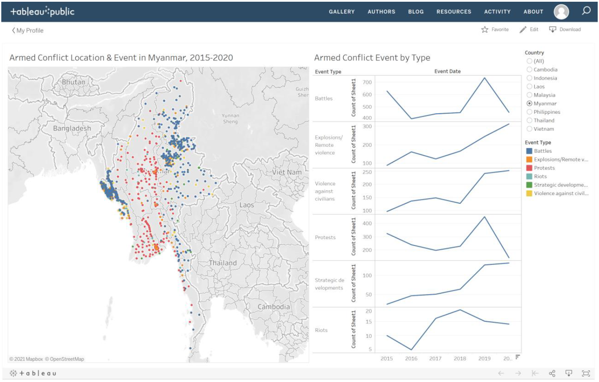
```

---

# **Graph Critiques**

|Clarity|Critique|
|-|--------|
|1.| The map shows a good scatter of the different event types. However, it does not tell us if the event has happened once, or a few times in the area. Therefore we are unable to gauge how intense the armed conflict location is.|
|2.| The map shows a scatter of the event types from 2015 to 2020. However, it does not give us an option to toggle the different year events, which may give us a better visualisation of the growing conflict in certain areas.|
|3.| The line graph axis title states "Count of Sheet1". This does not tell us if this is the count of event occurrences or something else. It is not clear what it is trying to indicate.|
|4.| Armed Conflict Event by Type does not indicate if it is only for Myammar, or for all countries|
|5.| When you hover over the map, the tooltip that appears does not give good information about the data point. It does not indicate the town, but only gives us the geolocation. Next, it gives us the event ID, which does not indicate where the ID is from, or where we can reference it to|


|Aesthetics|Critique|
|-|--------|
|1.| The colours of the dots in the map do not show some transparency, therefore they overlap each other, blocking some data that are behind|
|2.| The colours chosen - green and red, are not colour blind friendly. Therefore people who are slightly colour blind may not be able to distinguish between the two data points|
|3.| The sizes of the dots are too small to be able to see clearly on the map. The colour yellow also tends to fade into the background.|


---

# **What Can Be Improved?**

```{r, echo=FALSE, fig.cap="Sketch of Tableau Design", fig.align='center',layout="l-body-outset",dpi=300, fig.width=12, fig.height=6}
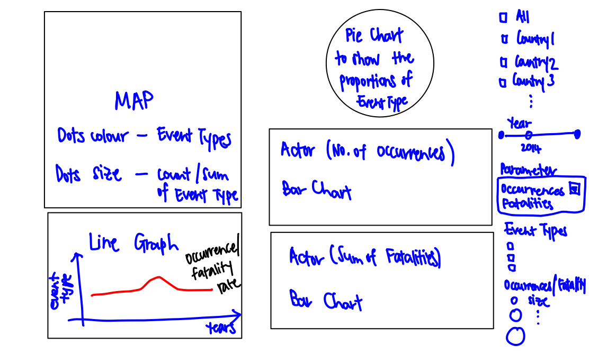
```

|No. |Improvements|
|-|--------|
|1.| A Multiple Value List for countries has been added, so that users are able to toggle between viewing 1 country, multiple countries or all. This helps them have a greater view of the region in one glance|
|2.|A slider for Year has been added, so that people are able to visualise the changes in conflict in the region over the years|
|3.| A Occurrences/Fatalities parameter is also included, so that the user may choose to view on the map the number of occurrences of conflict, or the number of fatalities due to conflict|
|4.| Colour blind friendly colour palette are chosen for the Event Type, so that people are able to clearly visualise better on the map. Some transparency to the colours are included, so that we are able to visualise the data points on the map despite overlap.|
|5.| I have included a Count of Occurrences, or Sum of Fatalities, to the size of the dots represented on the map. This will help us visualise where are the areas of higher conflict intensity, and fatality rates|
|6.| A line graph of Occurrences and Fatalities are added to see changes in armed conflict over the years of different event types|
|7.| A Pie chart is added to be able to visualise the proportion of event types or fatalities occurring in a country|
|8.| Bar charts are added to indicate the parties involved in the number of occurrences count, and also fatality count. This help us pinpoint who is accountable|


---

# **Proposed Tableau Visualisation**

```{r, echo=FALSE, fig.cap="Proposed Tableau Design", fig.align='center',layout="l-body-outset",dpi=300, fig.width=12, fig.height=6}
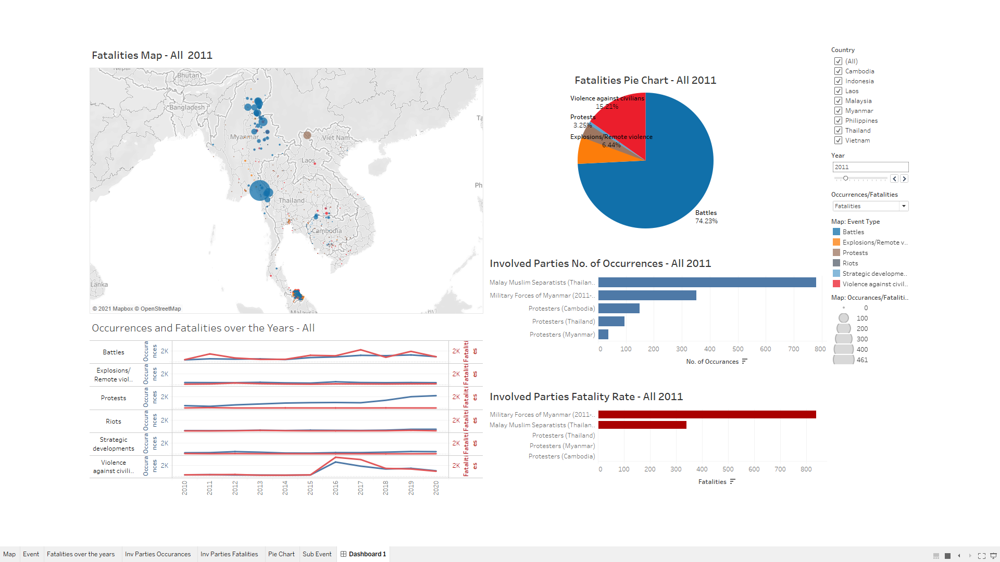
```

An interactive experience can be found at this link:
https://public.tableau.com/profile/louelle.teo#!/vizhome/DatavizMakeover3/Dashboard1?publish=yes


---

# **Step by Step Guide to Prepare the Tableau Visualisation**

## Preparing the Dataset

```{r, echo=FALSE, fig.cap="Excel Dataset", fig.align='center',layout="l-body-outset",dpi=300, fig.width=12, fig.height=6}

```

Download the data from  The Armed Conflict Location & Event Data Project (ACLED), focusing on South East Asia data set.

```{r, echo=FALSE, fig.cap="Add to Tableau", fig.align='center',layout="l-body-outset",dpi=300, fig.width=12, fig.height=6}
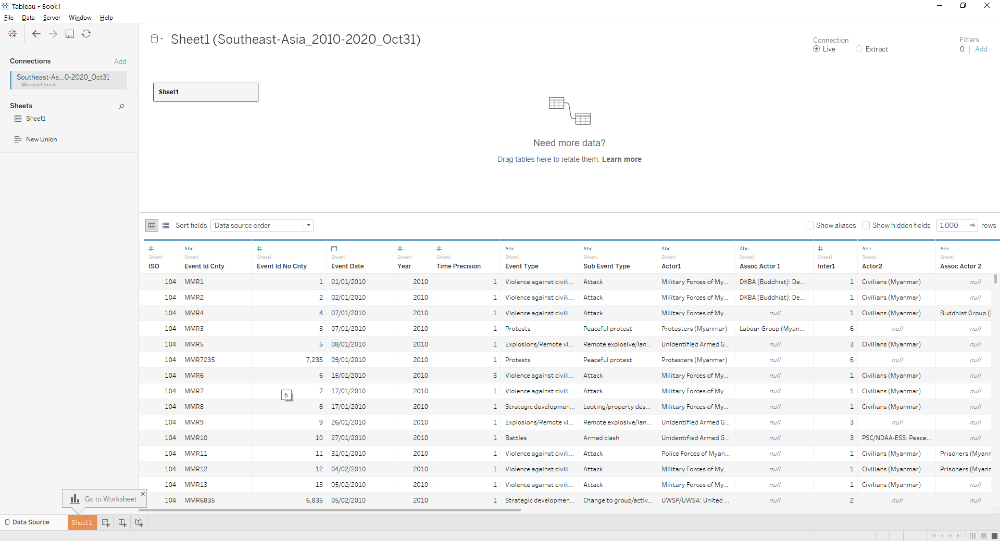
```

Open the data set using Tableau 2020.4. Tablleau will give a summary of all columns of data available and identify each type of data set and it's properties.

## Map Dashboard

```{r, echo=FALSE, fig.cap="Update the column Properties", fig.align='center',layout="l-body-outset",dpi=300, fig.width=12, fig.height=6}
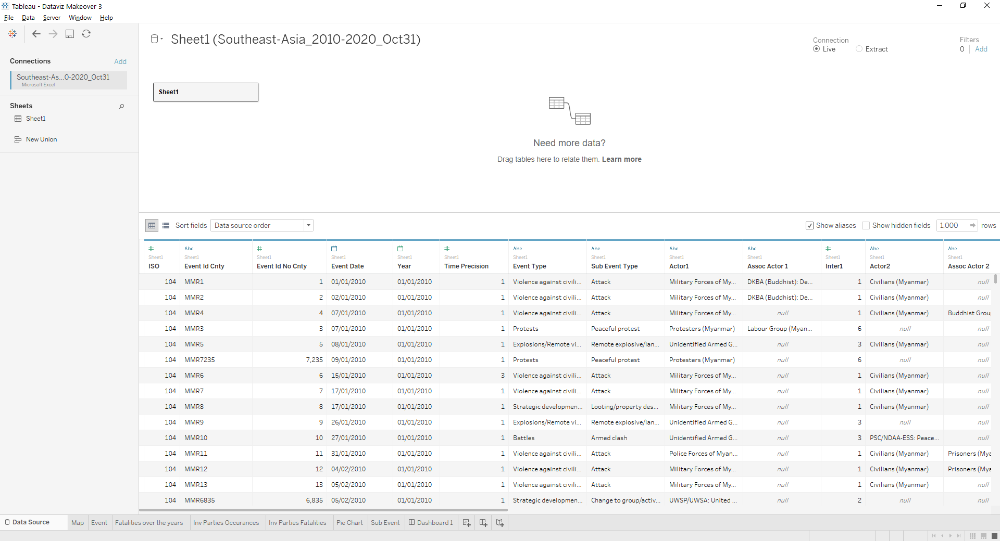
```

Update the correct properties for each column. </br>
1. *Year* properties should be updated to date format. </br>
2. Ensure Longitude and Latitude have geolocation properties. </br>
3. Categorical data have string properties </br>
4. Numerical data have number properties.

```{r, echo=FALSE, fig.cap="Create Parameter", fig.align='center',layout="l-body-outset",dpi=300, fig.width=12, fig.height=6}
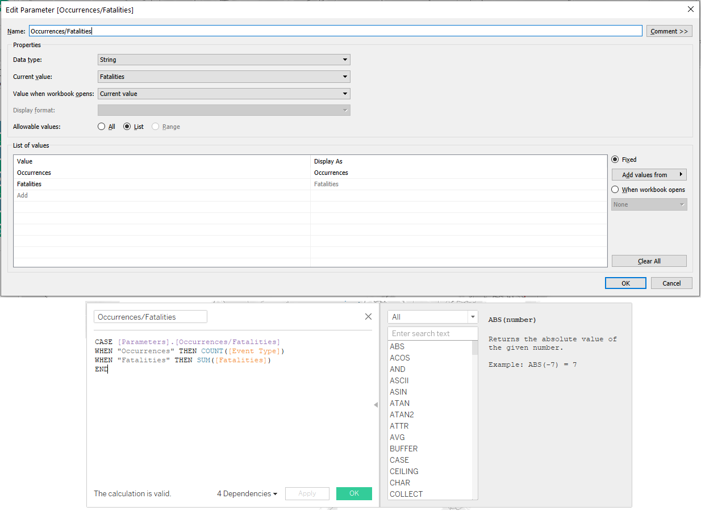
```

Create a Parameter **Occurrences/Fatalities** to create a dropdown choice for users to toggle. </br>
Create a measured value with the following code, so that tableau is able to pick up the correct formulas when users toggle. </br>

- Occurrences will have the formula Count([Event Type]). This will give us visibility of the count of events that occurs in a region. </br>
- Fatalities will have the fomula SUM([Fatalities]). This will give us a sum of the number of victims in armed conflicts in a region. </br>

```{r, echo=FALSE, fig.cap="Building the Map", fig.align='center',layout="l-body-outset",dpi=300, fig.width=12, fig.height=6}
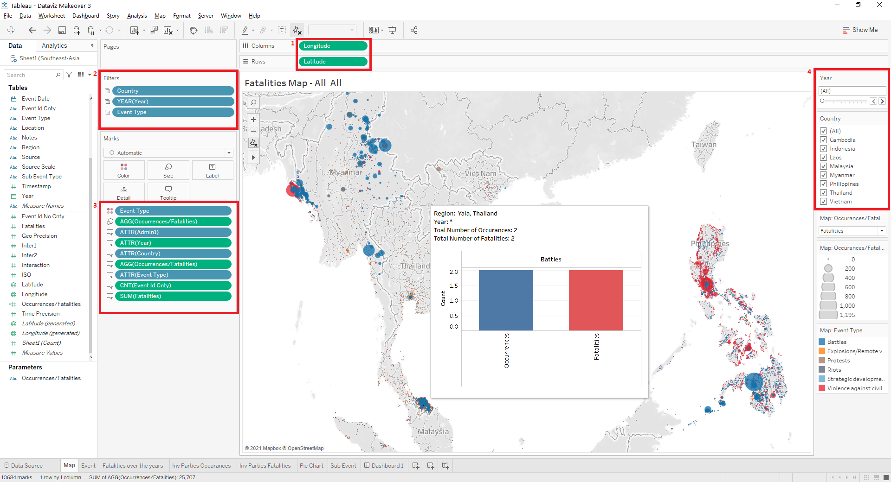
```

1. Add Longitude and Latitude to the **Columns** and **Rows** as seen in *Figure 1*
2. Add Country, Year and Event Type to *Figure 2*
3. Add Event Type to **Colours**, Measured Values Occurrances/Fatalities to **Size**, Admin 1, Year, Country, Occurrances/Fatalities, Event Type, Event Id Cnty, and  Fatalities to **Labels** as seen in *Figure 3*.
4. Choose to **show filter** for Year, and Country, and choose the **Single Value Slider** for Year, and **Multiple Values (list)** for Country as shown in *Figure 4*
5. Name this Sheet as "Map"


```{r, echo=FALSE, fig.cap="Map Tooltips", fig.align='center',layout="l-body-outset",dpi=300, fig.width=12, fig.height=6}
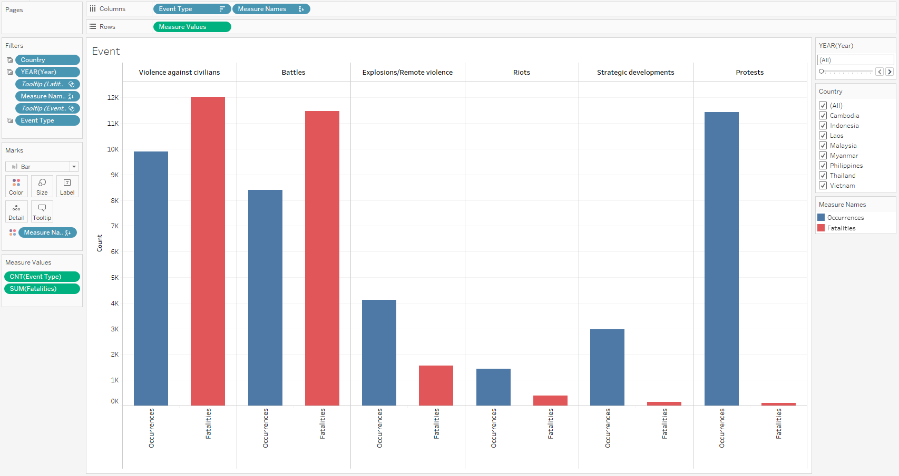
```

Next, we will create this histogram graph for a tooltip in maps. It will indicate the Number of Occurrences and Fatalities of a region, based on Event Type.

1. Add Event Type into **Columns**
2. Add Measured Values into **Rows**
3. Choose count(Event Type) and Sum(Fatalities) as the **Measured Values**
4. Add Country, Event Type and Year to **Filter**
5. Rename Aliases of Measure Names to Occurrances and Fatalities.
6. Name this Sheet "Event"

```{r, echo=FALSE, fig.cap="Map Tooltips", fig.align='center',layout="l-body-outset",dpi=300, fig.width=12, fig.height=6}
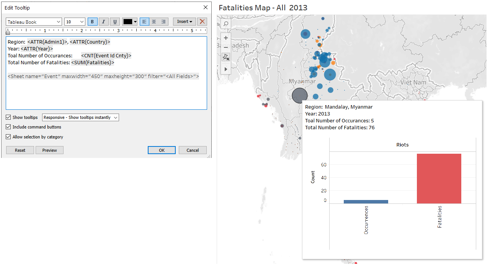
```

Finally, go back to the Map Sheet. Edit the Tooltip with the following code. this is so when the user hovers over a point in the map, the Event Tooltip will appear with the following details.

## Line Graph - Occurrances and Fatalities over the Years Dashboard

```{r, echo=FALSE, fig.cap="Line Graph", fig.align='center',layout="l-body-outset",dpi=300, fig.width=12, fig.height=6}
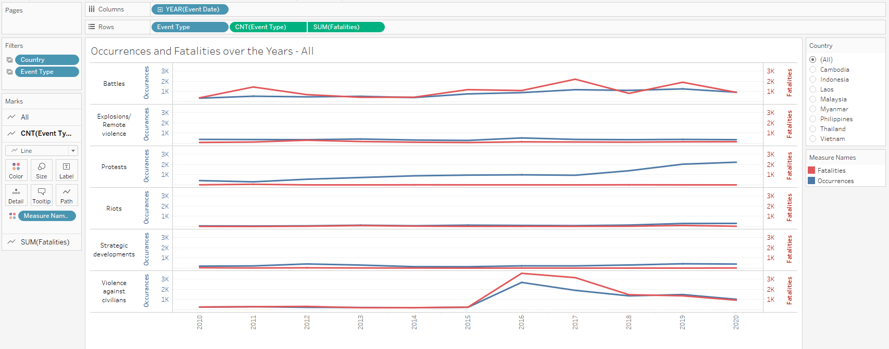
```

1. Add Year to **Columns**
2. Add Event Type to **Rows**
3. Change the Measure of Event Type in **Rows** to Count
4. Add Fatalities to *Rows**
5. Change the Measure of Fatalities in **Rows** to Sum
6. Right Click Fatalities and choose Dual Axis
7. Right click on the Second Axis on the Chart, and click **Synchronize Axis**
8. Add Event Type Category again to **Rows**
9. Add Country and Event Type to Filter
10. Add Measure Names to Colours and update the colours accordingly 
11. Name the Sheet "Fatalities over the years"

## Bar Graph - Involved Parties Dashboard

```{r, echo=FALSE, fig.cap="Bar Graph - Number of Occurrences", fig.align='center',layout="l-body-outset",dpi=300, fig.width=12, fig.height=6}
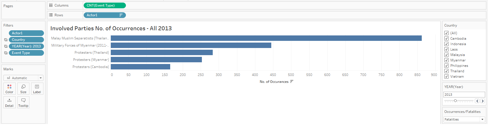
```

1. Add Event Type to **Columns**
2. Update the Measure of Event Type to **Count**
3. Add Actor 1 to **Rows**
4. Add Actor 1, Country, Year and Event Type to **Filters**
5. Rename Sheet to "Inv Parties Occurrences" 

```{r, echo=FALSE, fig.cap="Bar Graph - Fatality Rate", fig.align='center',layout="l-body-outset",dpi=300, fig.width=12, fig.height=6}
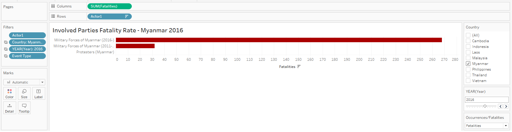
```

1. Add Event Type to **Columns**
2. Update the Measure of Event Type to **Sum**
3. Add Actor 1 to **Rows**
4. Add Actor 1, Country, Year and Event Type to **Filters**
5. Rename Sheet to "Inv Parties Fatalities"

## Pie Chart Dashboard

```{r, echo=FALSE, fig.cap="Pie Chart", fig.align='center',layout="l-body-outset",dpi=300, fig.width=12, fig.height=6}
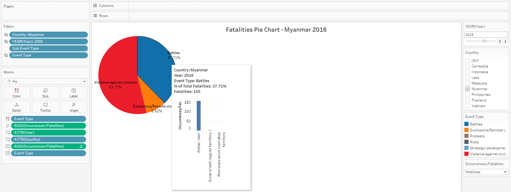
```

1. Add Country, Year, Event Type to **Filters**
2. Under Marks, Choose **Pie**
3. Add Event Type to **Colours**
4. Add Occurrences/Fatalities to **Angle**
5. Add Year, Country to **Tooltip**
6. Add Occurrences/Fatalities, and Event Type to **Label**
7. Rename Sheet as "Pie Chart"

```{r, echo=FALSE, fig.cap="Pie Chart - Tooltip", fig.align='center',layout="l-body-outset",dpi=300, fig.width=12, fig.height=6}
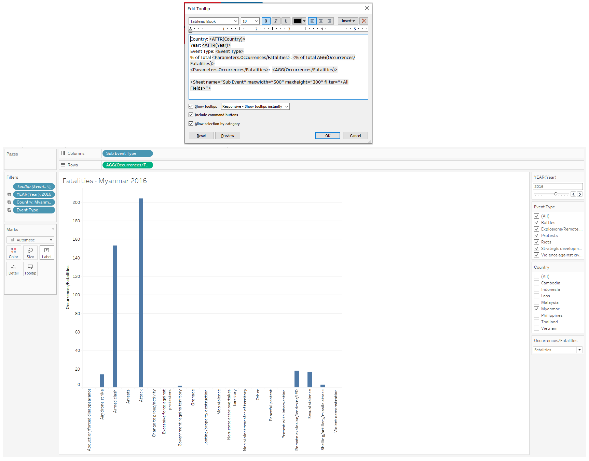
```

1. Add Sub Event to **Columns**
2. Add Occurrances/Fatalities to **Rows**
3. Add Year, Country and Event Type to **Filters**
4. Rename Sheet as "Sub Event"
4. Return to Sheet "Pie Chart" and add **Tooltips** according to the formula in the Figure

## Compiling the Dashboard

```{r, echo=FALSE, fig.cap="Compiling the Dashboard", fig.align='center',layout="l-body-outset",dpi=300, fig.width=12, fig.height=6}
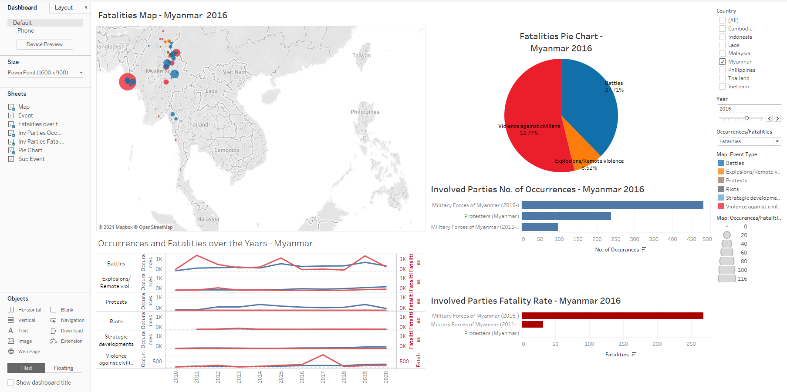
```

1. Compile the different sheets into the dashboard as above
2. Ensure that the Country Filter are linked to all the sheets, through "Apply to Worksheets"
3. Ensure that the Year is linked too all sheets except "Fatalities over the Years"
4. Ensure that Parameter Occurrences/Fatalities is linekd to all sheets.

The Visualisation is finally done, and final product can be viewed through Tableau Public
https://public.tableau.com/profile/louelle.teo#!/vizhome/DatavizMakeover3/Dashboard1?publish=yes

# Five Major Observations from the Visualisation

|No. |Observations|
|-|--------|
|1.| Since 2010, the number of protest occurrences have risen over time across ASEAN. This is especially true for Indonesia and Thailand. However, the number of fatalities have generally remained low relative to the rise in protests. |
|2.| Across ASEAN, the number of occurrences and fatalities from violence against civilians are concentrated in three key clusters. First, in Myanmar, and especially in the Rakhine and Shan regions. Second, in the Philippines, and involving the Police Forces of the Philippines and Anti-Drug Vigilantes. Lastly, in the Southern Thai provinces of Yala, Narathiwat, and Pattani, involving the Malay Muslim Separatists in Thailand.|
|3.| The number of battles have also risen over time. These battles generally occur in the same regions where we see violence against civilians, namely the Northern Myanmar provinces of Shan and Kachin, Mindanao in Southern Philippines, Southern Thailand provinces of Yala, Narathiwat and Pattani, and also Papua in Indonesia.|

